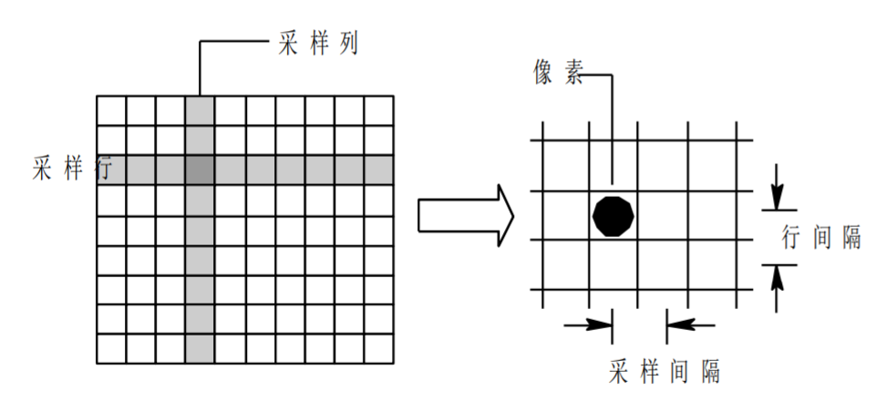
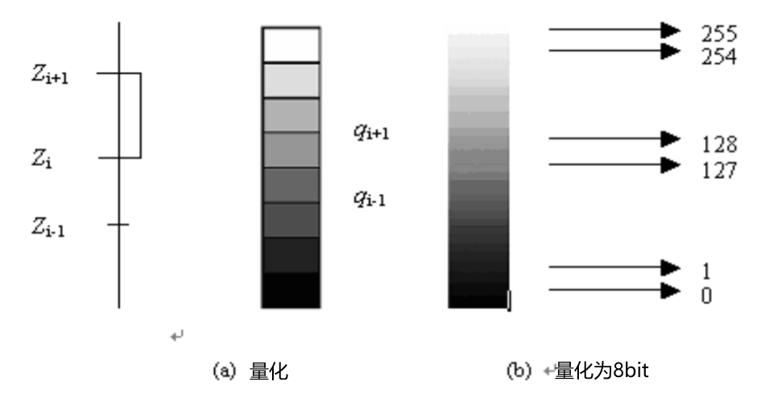
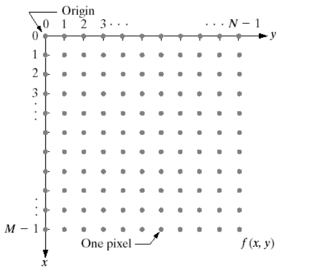

# 数字图像的基本概念

## 1.数字图像与模拟图像的定义

​	图像按照空间坐标和亮度（或色彩）的连续性可分为模拟图像和数字图像。

1. **数字图像（Digital Image）**：采用数字的表达方式来记录图像，是一个离散采样点的集合，例如电脑中的图片文件。

2. **模拟图像（Analog Image）**：通过某种连续的物理量，例如光或电的强弱变化，来记录图像的信息，例如生活中的胶卷。

3. 什么是**图像的采样**？

   是将在空间上连续的图像转换成离散的采样点（即像素）集的操作。即：空间坐标的离散化。(Digitizing the coordinate values)。决定图像的空间分辨率。

   用一个网格把待处理的图像覆盖，然后把每一小格上模拟图像的各个亮度取平均值，作为该小方格中点的值。

   

4. 什么是**图像的量化**？

   把采样后所得的各像素的灰度值从模拟量到离散量的转换称为图像灰度的量化。即：灰度的离散化。(Digitizing the amplitude values)，它决定了图像的幅度(灰度级)分辨率。

   量化过程在每个像素点的幅度值用与它接近的离散的量来表示时存在**失真**,此为**量化噪声**。

   量化的精细程度(表示这个点幅度值的二进制位数)决定量化噪声的多少

   二进制位数越多，则量化的越精细，量化噪声越少，图像质量越好。

   

5. 如何得到**从模拟图像得到数字图像**？

   从模拟图像得到数字图像：通过采样加量化得到。模拟图像通过采样，将空间中连续的图像离散化得到像素网格，再对每个像素中心点连续的灰度值进行量化表示。

   

## 2.图像的灰度级、分辨率、存储格式

1.灰度

表示某像素位置上亮暗程度的整数称为**灰度**。目前，使用的灰度级一般是64~256，以**256级灰度为例**，一般以**0表示全黑**，而**255表示全白**。实际上，人眼所能分辨的灰度级大约是40级，并不能分辨256灰阶中相邻的两个灰度。灰度级的一般是2的整数次幂。

$$
L=2^k
$$

> 1.L表示灰度级。
>
> 2.k表示像素值所需要的二进制的位数。

2.空间分辨率

用单位距离内可分辨的最大线对数来度量。如用黑白交替的垂线构造图形，线宽为W，黑白线对宽为2W，则单位距离内有1/2W个线对。在印刷行业，用每英寸点数来表示dpi。离开空间单位谈图像大小（如图像分辨率为1024*1024像素）没有意义。所以空间分辨率是：一副图像中可分辨的最小细节，或单位距离可分辨的最小线对数目。

空间分辨率由采样来决定，采样越细，空间分辨率越大。从人眼感知来采样间隔为4x4和8x8时，4x4采样的图像更为清晰。（没有太多的马赛克。）

3.灰度分辨率

图像灰度级中可分辨的最小变化。用于量化灰度的比特数，如256个灰度级，则灰度分辨率为8。通常将灰度级数作为灰度分辨率，灰度分辨率主要由量化所决定。

4.数字图像的表示

用矩阵表示数字图像

图像可以表示为二维函数f（x，y）。（x，y）是空间或平面坐标，f的振幅被称为亮度、强度或**灰度级**。例如：f（2,1）=144，表示第2行1列的像素灰度值为144。

当（x，y）和f值是有限的离散量时，图像是数字图像。

x表示行，y表示列.每一个像素点都具有相应的灰度级。

5.图像的存储

存储数字化图像所需的位数b为（若一个k位位图的像素个数位为M*N，则其位数为:）
$$
b=M*N*k
$$

> 1.M和N分别为图像的宽和高。

通常将图像称为“k位图像”。例如，具有256个可能灰度值的图像被称为8位图像。

> 例如一张图像的宽和高为500x500，图像的灰度级为256，则k=log(2)256=8。得：b=500x500x8=2000000（bit）

6.图像存储格式

​	数字图像放在记忆卡中的格式、及压缩方式。

​	BMP

​	--采用位映射存储格式，与硬件设备无关
​	-- 除了色彩分辨率可选以外，不采用其他任何压缩
​	-- 扫描格式是按从左到右、从下到上的顺序 

​	JPEG (Joint Photographic Experts Group)格式

​	-- 采用有损压缩方式去除图像数据中的冗余信息
​	-- 可以在获取极高的压缩率的同时保持图像质量

​	GIF (Graphics Interchange Format)格式
​	-- 一种连续色调的无损压缩格式，压缩率在50%左右
​	-- 存储量相对小，成像清晰，适合于初期的互联网

​	PNG (Portable Network Graphics)格式
​	-- 便携式网络图像格式
​	-- 存储量相对小，压缩比高
